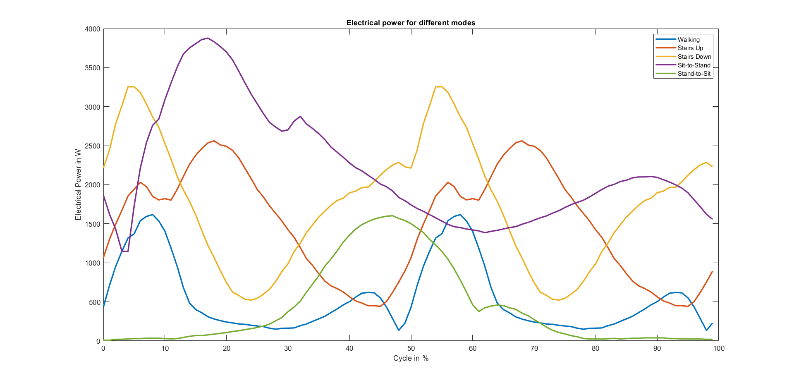

# Exoskeleton Battery Sizing
Dimensioning of a LFP battery for a 3-DOF Lower Limb Exoskeleton

## Introduction
The purpose of the Matlab simulation was to calculate the capacity and power of the battery. The data base are trajectories for five different modes: Walking, Stairs-up, Stairs-Down, Sit-to-stand, Stand-to-sit.

## Structure
1.	Import parameters
2.	Extract trajectory data from scientific literature with [DataThief](https://www.datathief.org/)
3.	Import trajectories (either rpm and torque trajectories or mechanical power)
4.	If rpm and torque imported: calculate mechanical power in W/kg
5.	Get absolute values of mechanical power and add second leg (50% offset for walking, stairs-up and stairs-down)
6.	Calculate efficiency for motor based on rpm vs. efficiency over cycle (see plots)
7.	Calculate electrical power for each mode
8.	Outputs: Average power based on load collective, max. current based on peak power, capacity based on average power and running time

9. Average current for each actuator
10. Peak power reduction through supercaps 

## Results
The following graph shows the power of the exoskeleton in W for the different modes:

<figure>
  
  <figcaption>Fig.1 - Power over Cycle </figcaption>
</figure> 

 
 
 

The following results define the specs for the battery. It has to be noted that the high current results from the high torques in the stand-up and stairs-up mode. This torque can be reduced in practice by lowering the speed of the movements. (Movement speed of the trajectories was almost healthy human speed)  

| Battery Parameter |	Value | Unit |
| ----------- | ----------- | ----------- |
| Capacity	| 661.6	| Wh	|   
| Capacity	| 13.8	| Ah	| 
| Max. Current	| 82.5	| A	| 

The final decision was to use two times the [48V, 10Ah, 30A LFP Battery](https://www.akkushop-24.de/Lithium-Ionen-Akkupack-12V-15Ah-15A_13) with one battery for each leg. 
